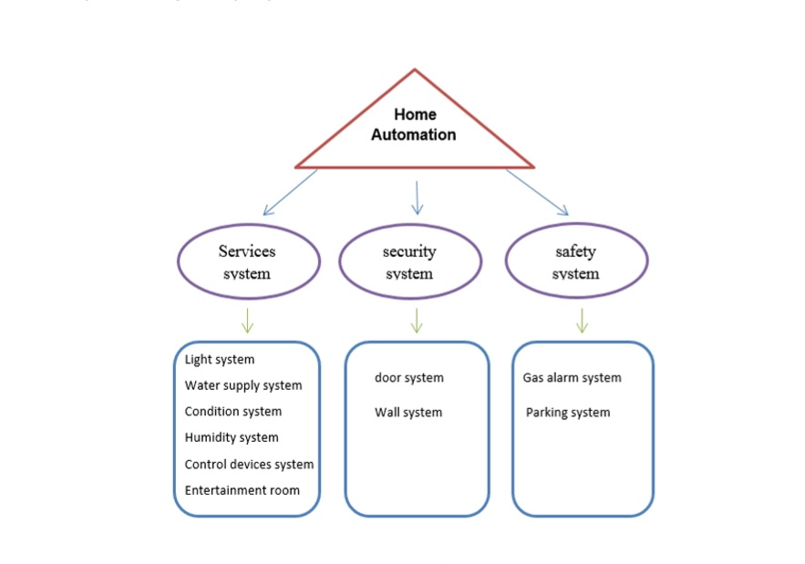
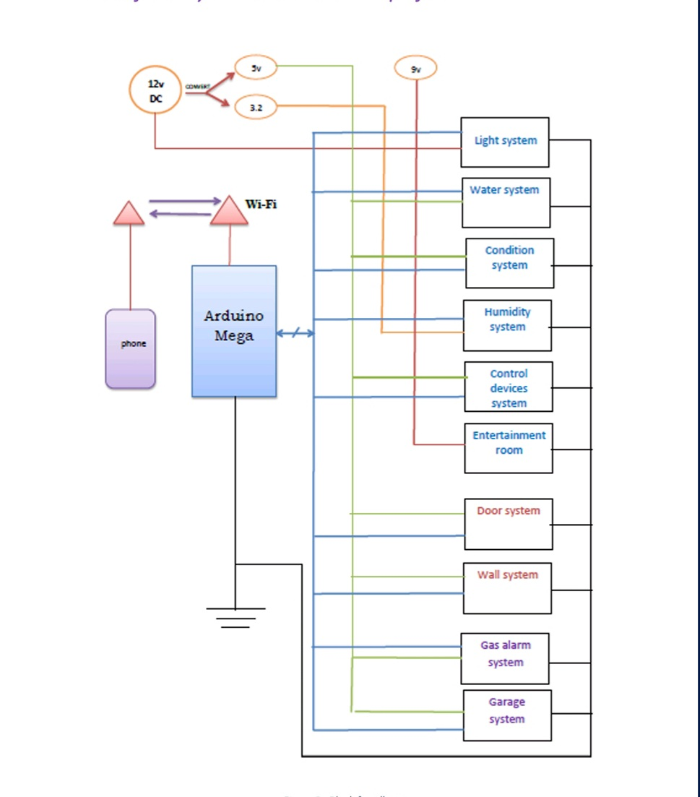
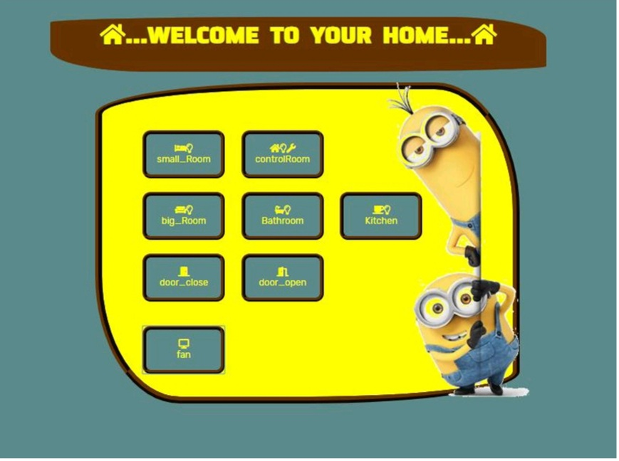
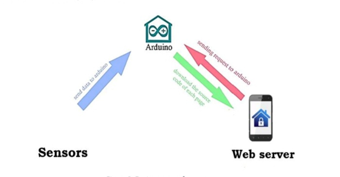

# 🏢 Smart Building Management System

An IoT-based Smart Building Automation System developed using **Arduino Mega 2560** and **ESP8266 WiFi Module**.

This project integrates multiple intelligent subsystems into one centralized automation platform that enables real-time monitoring and remote control via a web interface.

---

## 📌 Project Overview

The Smart Building Management System combines several building subsystems into one unified architecture to improve:

- Automation  
- Security  
- Safety  
- Energy Efficiency  

The system is organized into three main categories:

### 🏗 Services System
- 💡 Lighting Control System  
- 💧 Water Level Monitoring  
- 🌡 Temperature & Humidity Control  
- 🎛 Control Devices System  
- 🎵 Entertainment Room System  

### 🔐 Security System
- 🚪 Smart Door Monitoring  
- 🧱 Wall Intrusion Detection  

### 🚨 Safety System
- 🔥 Gas Leakage Detection  
- 🚗 Smart Parking Monitoring  

---

## 🧠 System Architecture

The system architecture consists of:

- **Arduino Mega 2560** → Main microcontroller  
- **ESP8266** → WiFi communication module  
- Environmental Sensors (DHT, MQ Gas, Ultrasonic, etc.)  
- Actuators (Relays, LEDs, Buzzer, LCD Display)

### 🔄 Data Flow

Sensors → Arduino Mega → ESP8266 → Web Interface  

Web Commands → ESP8266 → Arduino Mega → Actuators  

This structure ensures real-time monitoring and remote control capability.

---

## 📷 System Images

### 🏗 System Overview

### 🔌 Circuit Diagram

### 🌐 Web Interface

### 🌍 System Environment

---

## ⚙️ Technologies Used

- C / C++  
- Arduino IDE  
- Embedded Systems Programming  
- ESP8266 WiFi Communication  
- Basic Web Interface Integration  

---

## 🔌 Hardware Components

- Arduino Mega 2560  
- ESP8266 WiFi Module  
- DHT11 / DHT22 Temperature & Humidity Sensor  
- MQ Gas Sensor  
- Ultrasonic Sensor  
- Relay Module  
- LCD Display  
- Buzzer  
- Supporting electronic components  

---

## 🚀 Key Features

- Real-time environmental monitoring  
- Remote control via WiFi  
- Integrated multi-subsystem architecture  
- Gas leakage alarm with buzzer alert  
- Automated lighting and environmental control  
- Parking detection using ultrasonic sensing  

---

## 🧩 Engineering Concepts Applied

- Embedded Systems Design  
- Serial Communication (Arduino ↔ ESP8266)  
- Sensor Data Acquisition & Processing  
- Real-Time Monitoring  
- Control Logic Implementation  
- IoT-Based Remote Communication  
- Safety & Security System Integration  

---

## 🔄 Communication Strategy

The system uses serial communication between Arduino Mega 2560 and ESP8266.

- Arduino collects sensor data.  
- Data is transmitted to ESP8266 via Serial communication.  
- ESP8266 manages WiFi connectivity and updates the web interface.  
- Web commands are sent back to Arduino to control actuators.  

This communication structure ensures reliable and efficient real-time system performance.

---

## 🔮 Future Improvements

- Mobile application integration  
- Cloud-based data logging  
- Enhanced communication security  
- Database storage for historical monitoring data  
- Scalable architecture for larger buildings  

---

## 👩‍💻 Author

**Aisha Alnawar**  
Electrical Engineering – Computer & Control Systems  
Embedded & IoT Developer
